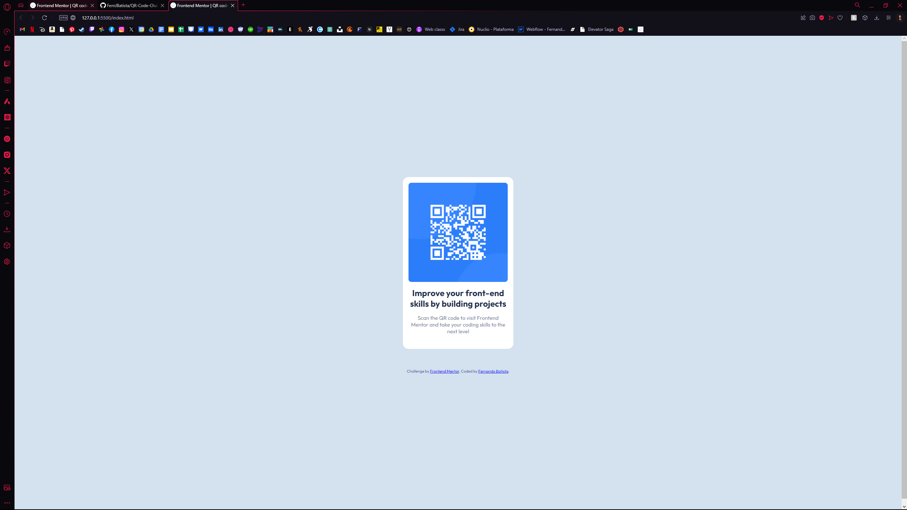

# Frontend Mentor - QR code component solution

This is a solution to the [QR code component challenge on Frontend Mentor](https://www.frontendmentor.io/challenges/qr-code-component-iux_sIO_H). Frontend Mentor challenges help you improve your coding skills by building realistic projects.

## Table of contents

- [Overview](#overview)
  - [Screenshot](#screenshot)
  - [Links](#links)
- [My process](#my-process)
  - [Built with](#built-with)
  - [What I learned](#what-i-learned)
  - [Continued development](#continued-development)
- [Author](#author)


## Overview

### Screenshot



### Links
- Solution URL: (https://fernjbatista.github.io/QR-Code-Challenge/)


## My process
Here I will briefly describe what my thought process was, and how I tackled this challenge.

  I decided to give the body a flex display and a flex-direction of column to make the layout vertical and visualize the elements. I then created <div class="code-container"> with containing the image, the header text, and the paragraph text to style properly as the qr code container in the image. I gave this div a flex display, and column direction as well. 
  
  When styling the container I just tried to guess the padding & margings of the elements from the image provided. Made the rounded corners and sized down <div class="code-container"> to again what I guessed is an approximate meassure.

  Lastly I sepparated <div class="attribution"> from <div class="code-container"> to give it a better look. 


### Built with
- CSS custom properties
- Flexbox
- CSS Grid


### What I learned
In the process of making this I think I tried to focus on too many things at the same time. Maybe in my workflow I could try to organize what needs to be done first before iterating over and over without having everything properly determined.

```

### Continued development

I wasn't sure how to separate <div class="attribution"> to completely make it go to the bottom while keeping the <div class="code-container"> in the center, I would like to find a way to fix this.

## Author

- Website - [Fernando Batista] (https://www.fernando-batista.webflow.io)
- Frontend Mentor - [@FernJBatista] (https://www.frontendmentor.io/profile/FernJBatista)
